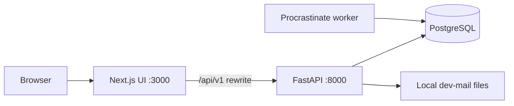
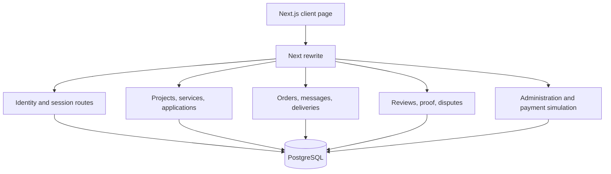
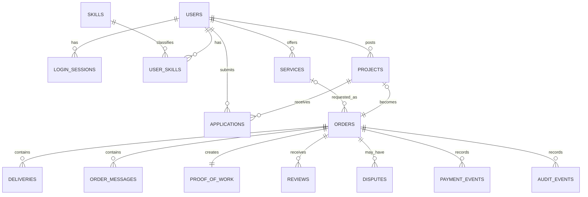
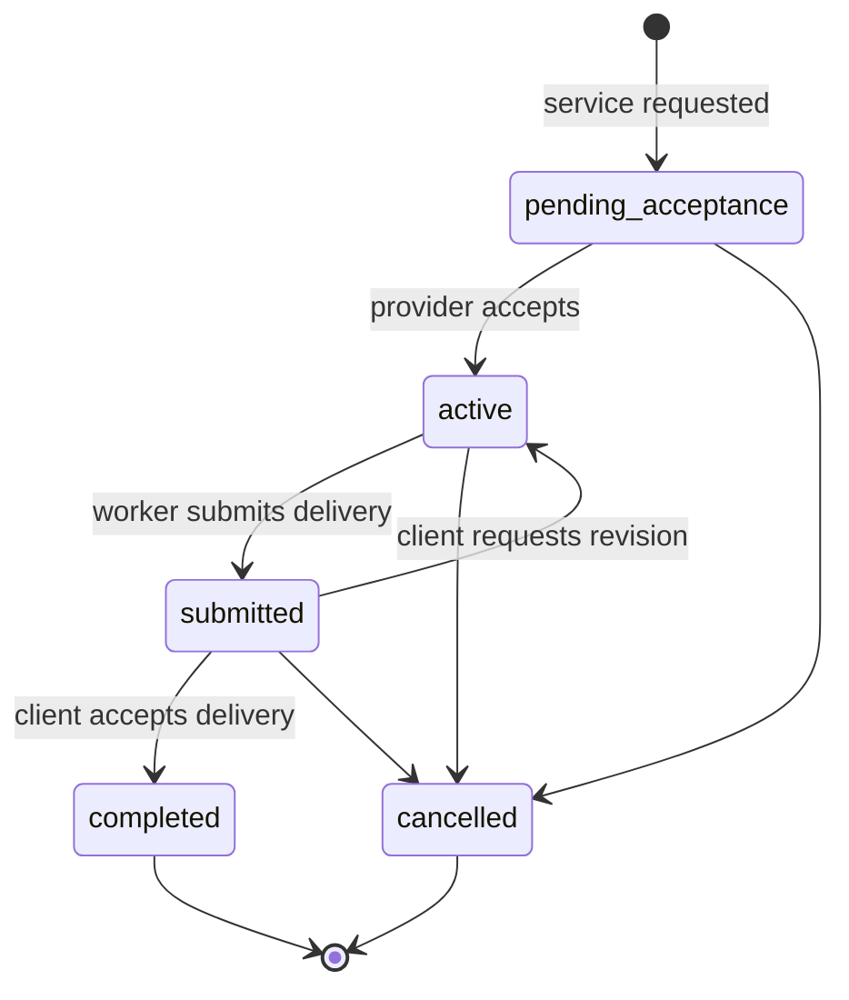

# Technical Design Document

## Purpose and scope

Skill-High is a local MVP marketplace for student and graduate talent. It supports profiles, project applications, service requests, orders, messages, deliveries, revisions, reviews, Proof-of-Work, disputes, and a development-only payment simulator.

This document describes the implementation in this repository, not a future target architecture.

## System context

- Next.js provides the browser UI and proxies `/api/:path*` to FastAPI during local development.
- FastAPI owns validation, authorization, marketplace workflows, and persistent state.
- PostgreSQL is the sole durable store for application data, sessions, and Procrastinate jobs.
- The worker has a PostgreSQL connector. Its notification task is available for manual development use; no production notification provider is integrated.
- Verification and reset messages are written to the local mail sink in development.

## Architecture

The API is deliberately one deployable modular monolith in `backend/app.py`. SQLAlchemy models, request validation, authorization helpers, and route handlers are colocated to keep the MVP small. Alembic owns the initial schema migration; `backend/seed.py` owns repeatable local data.

## Data model

All money is stored in integer minor units with an explicit three-letter currency. Orders snapshot title, scope, skills, amount, fee, currency, and estimated effort so later listing changes do not rewrite an agreement.

Important database constraints and indexes:

- `users.email`, `skills.name`, and `payment_events.provider_event_id` are unique.
- `applications(project_id, worker_id)`, `reviews(order_id, author_id)`, and `proof_of_work.order_id` are unique.
- `orders.project_id` is unique, enforcing one order per project in this MVP.
- Foreign keys protect ownership and dependent records; frequently queried ownership, status, and listing fields are indexed.

## Core workflows

For a project, a worker applies and the project client accepts an application under row locks. That directly creates an `active` order and marks the project assigned. For a service, the client creates a `pending_acceptance` order and the provider accepts it.

Completion locks the order, verifies the selected delivery and actor, rejects open disputes, marks payout status `ready`, creates exactly one Proof-of-Work record, and appends an audit event in the same database transaction. The unique proof record and completed-state guard make repeated completion safe.

Payment and payout state remain independent from work state. The development simulator only changes these states after server-side checks; it never contacts a payment processor or moves money.

## Security and access control

- Passwords use Argon2 hashes.
- Login creates opaque, server-side sessions stored in PostgreSQL. Session and CSRF cookies use `SameSite=Lax`; the session cookie is HttpOnly and becomes Secure in production mode.
- Authenticated mutations require the session and `X-CSRF-Token` value associated with it.
- Order messages, deliveries, reviews, disputes, and order retrieval require an order participant. Administration requires `is_admin` from the stored user record; profile updates cannot grant it.
- Registration validation uses Pydantic constraints. The local reset flow writes tokens to the development mail sink and does not return them in API responses.
- File uploads currently fail closed with HTTP 503 until a malware scanner is configured. Delivery URLs are supported instead.

## Search, matching, and polling

Public project and service searches use PostgreSQL `ILIKE` over listing titles. The schema has normal listing indexes; PostgreSQL full-text search is not implemented in this MVP.

The matching endpoint scores open projects with `20 × matching skills + 2 × min(available hours, estimated hours)`. It excludes a user's own projects and treats missing availability as zero. Messages use REST polling with an `after_id` cursor. Public listing responses include narrow person metadata, skill names, seller review aggregates, and detail history; private applicant, availability, order, proof, and dispute reads remain session-protected.

## Local operations

| Concern          | Mechanism                                                                        |
| ---------------- | -------------------------------------------------------------------------------- |
| Schema changes   | `uv run alembic upgrade head`                                                    |
| Development data | `uv run python backend/seed.py` (idempotent; refused in production)              |
| API              | `uv run uvicorn app:app --app-dir backend --reload --host 127.0.0.1 --port 8000` |
| UI               | `bun run dev`                                                                    |
| Worker schema    | `PYTHONPATH=backend .venv/bin/procrastinate --app worker.app schema --apply`     |
| Worker           | `PYTHONPATH=backend .venv/bin/procrastinate --app worker.app worker`             |
| Tests            | `uv run pytest backend/tests -q` against `skillhigh_test`                        |

## Known MVP boundaries

- There is no real payment provider, email provider, malware scanner, or object store.
- No API endpoint currently enqueues the example Procrastinate notification task; it proves the worker setup without making order completion depend on an external side effect.
- Listing search is title `ILIKE`, not full-text search.
- Frontend category labels are inferred from listing skills and title with an `Other` fallback; the schema has no persisted category column yet.
- The frontend is a focused single-page MVP rather than a separately routed interface for every resource.
